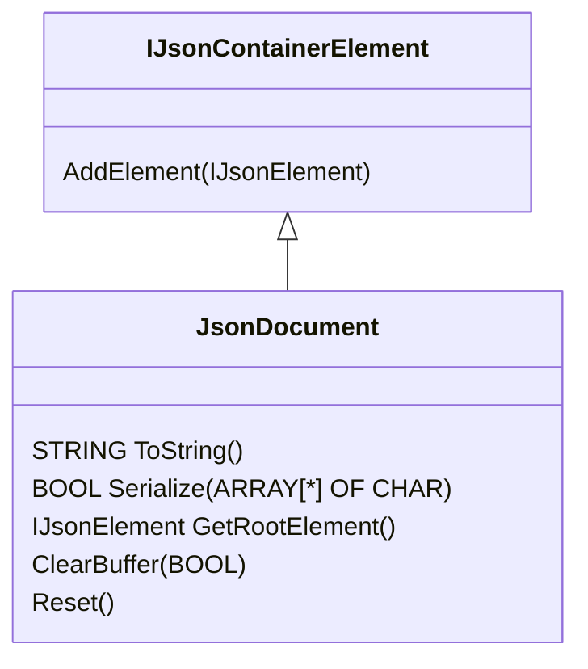

# Json Document

## Description
The JsonDocument contains the object model of the Json object.

## Object

## Methods

### ToString() : STRING

Returns the JSON string of the JSON document (max. 254 characters)

### Serialize(IN_OUT buf : ARRAY[*] OF CHAR) : BOOL
Serializes the JSON document ino a ARRAY OF CHAR

### GetRootElement() : IJsonElement
Returns root element of the JSON document

### AddElement(elem : IJsonElement)
Add a new element to the JSON document

### ClearBuffer(hard : BOOL)
Clear the buffer logically (fast). If `hard = TRUE` then delete the buffer also physically (slow)

### Reset()
Reset the complete object tree and the destination buffer of the JSON document for the purpose, a new JSON object should be created.

