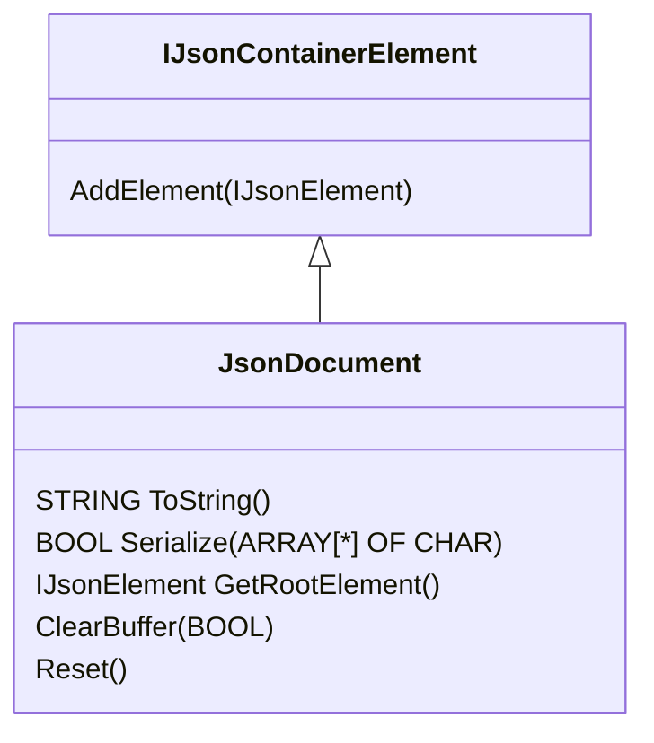

# Json Document

## Description
The JsonDocument contains the object model of the Json object.


## Object


## Methods

### ToString() : STRING

Returns the JSON string of the JSON document (max. 254 characters)

### Serialize(IN_OUT buf : ARRAY[*] OF CHAR) : BOOL
Serializes the JSON document ino a ARRAY OF CHAR

### GetRootElement() : IJsonElement
Returns root element of the JSON document

### AddElement(elem : IJsonElement)
Add a new element to the JSON document

### ClearBuffer(hard : BOOL)
Clear the buffer logically (fast). If `hard = TRUE` then delete the buffer also physically (slow)

### Reset()
Reset the complete object tree and the destination buffer of the JSON document for the purpose, a new JSON object should be created.

## Example
```iec-st
USING Simatic.Ax.Json;
USING AxUnit.Assert;

NAMESPACE Simatic.Ax
    CLASS JsonExample
        VAR PUBLIC
            
        END_VAR
        VAR PROTECTED
            doc : JsonDocument;
            e1 : JsonDoubleInt := (key := 'Element1', value := 1);
            e2 : JsonDoubleInt := (key := 'Element2', value := 2);
            e3 : JsonDoubleInt := (key := 'Element3', value := 3);
            o1 : JsonObject := (key := 'NestedObject');
            
        END_VAR
        
        METHOD PUBLIC Init;
            // Example String:
            // {"Element1": 1, {"Element2": 2, "Element3": 3}}            
            doc.AddElement(e1).AddElement(o1);
            o1.AddElement(e2).AddElement(e3);
        END_METHOD

        METHOD PUBLIC ToString : STRING
            ToString := doc.ToString();
        END_METHOD
    END_CLASS    
END_NAMESPACE
```

A complete application example, you can install with the command:

```sh
apax create @simatic-ax/ae-json-library --registry https://npm.pkg.github.com ae-json-library
axcode ae-json-library
```
